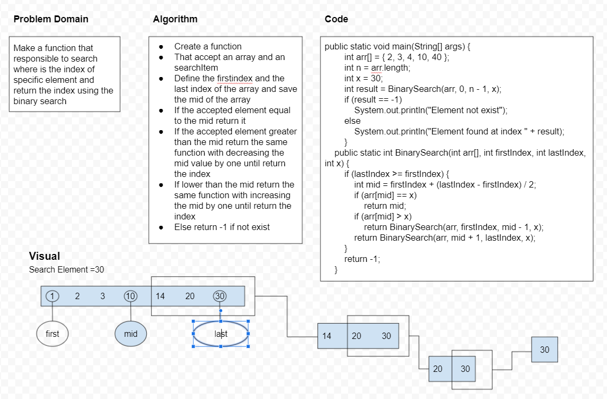

# Binary search
<!-- Description of the challenge -->
Make a function that responsible to search where is the index of specific element and return the index using the binary search
## Whiteboard Process
<!-- Embedded whiteboard image -->

<!-- ## Approach & Efficiency -->
<!-- What approach did you take? Discuss Why. What is the Big O space/time for this approach? -->