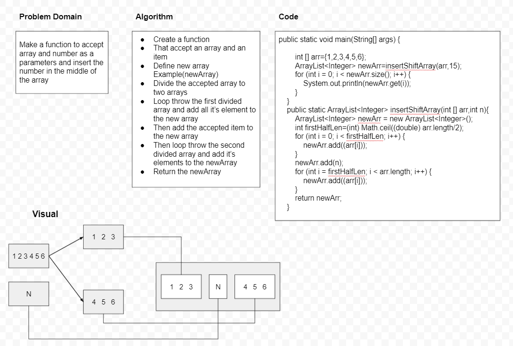

# Insert to Middle of an Array
<!-- Description of the challenge -->
Make a function to accept array and number as a parameters and insert the number in the middle of the array 
## Whiteboard Process
<!-- Embedded whiteboard image -->

<!-- ## Approach & Efficiency -->
<!-- What approach did you take? Discuss Why. What is the Big O space/time for this approach? -->