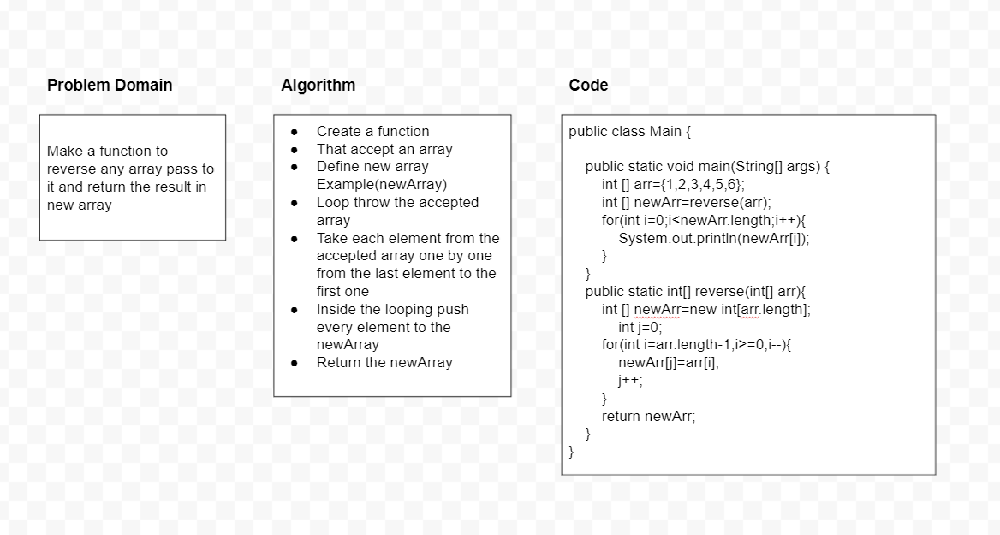

# Reverse an Array
<!-- Description of the challenge -->
Make a function to reverse any array pass to it and return the result in new array
## Whiteboard Process
<!-- Embedded whiteboard image -->

<!-- ## Approach & Efficiency -->
<!-- What approach did you take? Discuss Why. What is the Big O space/time for this approach? -->