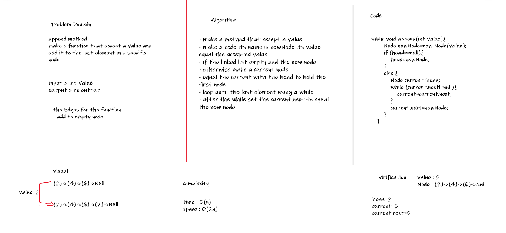
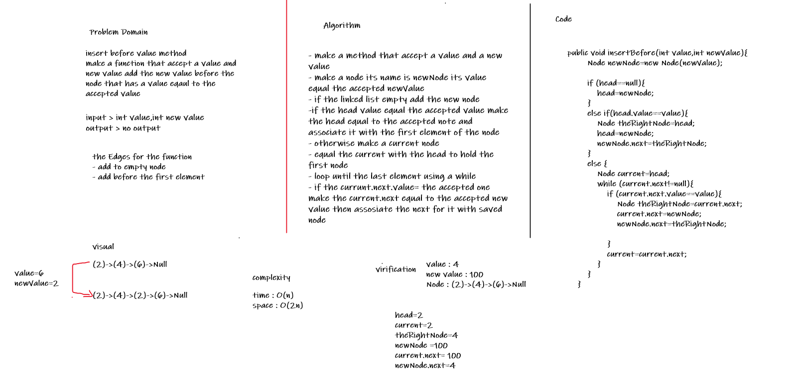
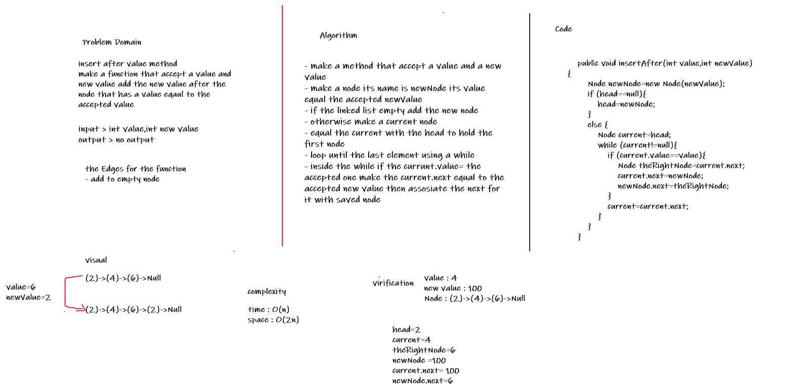
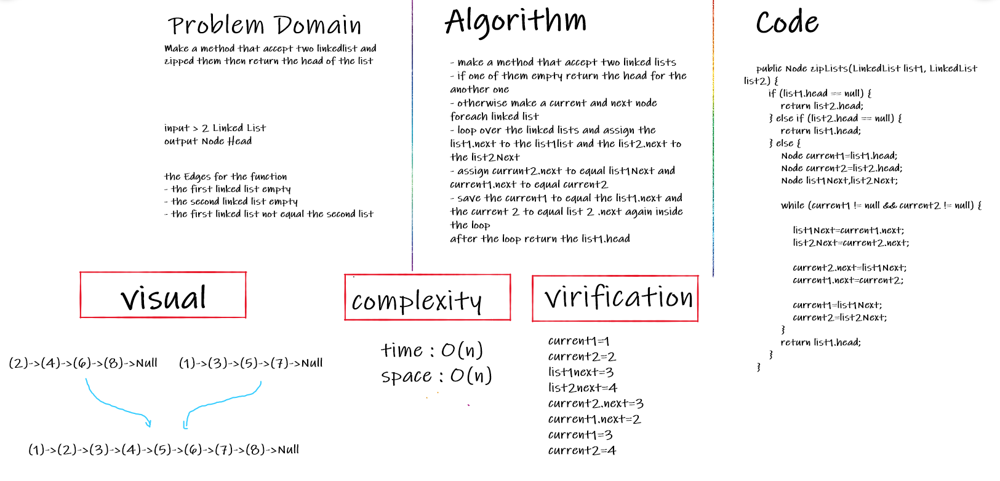

# Singly Linked List
<!-- Short summary or background information -->
Linked List is a linear data structure. Unlike arrays, linked list elements are not stored at a contiguous location; the elements are linked using pointers.

## Challenge
<!-- Description of the challenge -->
- Creating a node 
- Creating a Singly Linked list 
- Adding the insert method, the include method and the to string method
## Approach & Efficiency
<!-- What approach did you take? Why? What is the Big O space/time for this approach? -->
- insert method complexity : time (O(1)), space(O(n))
- includes method complexity : time (O(n)), space(O(n))
- toString method complexity : time (O(n)), space(O(n))

## API
<!-- Description of each method publicly available to your Linked List -->
- Insert Method : this function accept a integer value to insert new node as a first node in a linked list 
- Include Method : that accept a integer value and check if it's one of the node values inside the linked list if exist will return true otherwise will return false
- To String Method : that return a string representing all the values in the Linked List, formatted as:
"{ a } -> { b } -> { c } -> NULL"

============================================================
## Append Method
# Challenge Summary
<!-- Description of the challenge -->
add to the last node in the linked list 

## Whiteboard Process
<!-- Embedded whiteboard image -->

## Approach & Efficiency
<!-- What approach did you take? Why? What is the Big O space/time for this approach? -->
while loop to iterate over the linked list nodes 
the complexity:
- time :O(n)
-  space : O(n)

<!-- ## Solution -->
<!-- Show how to run your code, and examples of it in action -->
============================================================
## Insert Before Value Method
# Challenge Summary
<!-- Description of the challenge -->
method to add a new node before the node that has a value equal to the accepted value 

## Whiteboard Process
<!-- Embedded whiteboard image -->

## Approach & Efficiency
<!-- What approach did you take? Why? What is the Big O space/time for this approach? -->
while loop to iterate over the linked list nodes 
the complexity:
- time :O(2n)
-  space : O(n)

<!-- ## Solution -->
<!-- Show how to run your code, and examples of it in action -->
============================================================
## Insert After Value Method
# Challenge Summary
<!-- Description of the challenge -->
method to add a new node after the node that has a value equal to the accepted value 

## Whiteboard Process
<!-- Embedded whiteboard image -->

## Approach & Efficiency
<!-- What approach did you take? Why? What is the Big O space/time for this approach? -->
while loop to iterate over the linked list nodes 
the complexity:
- time :O(n)
-  space : O(n)

<!-- ## Solution -->
<!-- Show how to run your code, and examples of it in action -->
============================================================
## Zip two linked lists.
# Challenge Summary
<!-- Description of the challenge -->
method responsible about zipping two linked list and return the head for the zipped linked list

## Whiteboard Process
<!-- Embedded whiteboard image -->

## Approach & Efficiency
<!-- What approach did you take? Why? What is the Big O space/time for this approach? -->
while loop to iterate over the linked list nodes 
the complexity:
- time :O(n)
-  space : O(n)

<!-- ## Solution -->
<!-- Show how to run your code, and examples of it in action -->