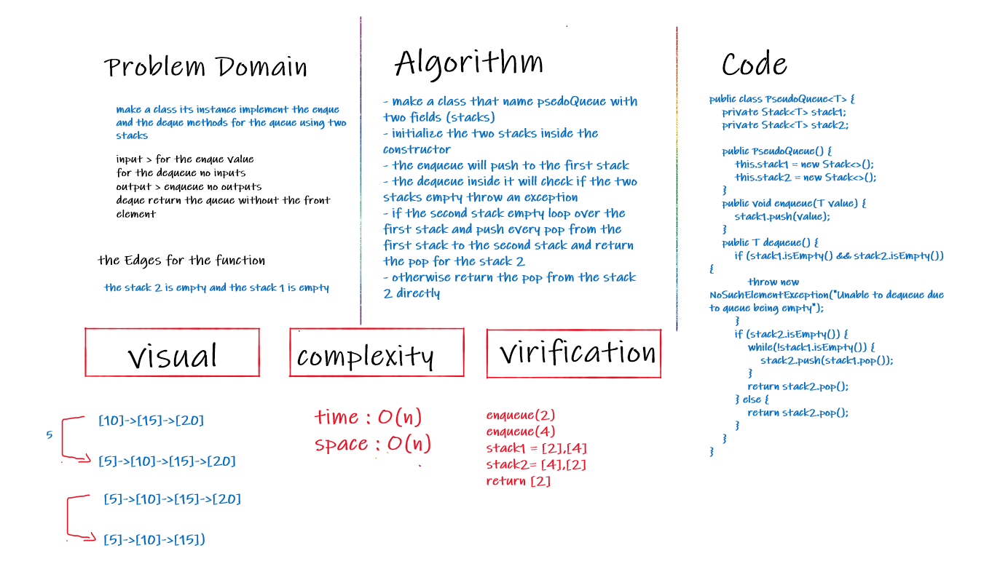
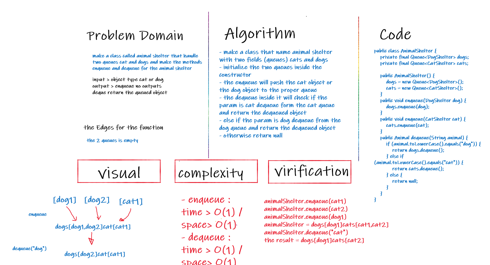

# Stack-and-Queue
<!-- Short summary or background information -->
A stack is an ordered list of elements where all insertions and deletions are made at the same end, whereas a queue is exactly the opposite of a stack which is open at both the ends meaning one end is used to insert data while the other to remove data.

## Challenge
<!-- Description of the challenge -->
- make the stack class and implement these method to it : push, pop,isEmpty and peek
- make the Queue class and implement these methods for it : enqueue, dequeue,isEmpty and Peek method
## Approach & Efficiency
<!-- What approach did you take? Why? What is the Big O space/time for this approach? -->
- push method complexity :O(1)
- Enqueue method complexity : O(1)
- pop method complexity : O(1)
- dequeue method complexity : O(1)
- isEmpty method complexity : O(1)
- peek method complexity : O(1)

## API
<!-- Description of each method publicly available to your Linked List -->
- push Method : this function accept a value and add it to the stack
- Enqueue Method : this method to accept a value and add a node with the same value to the Queue
- is empty Method : accept a Queue or Stack and return a true if is empty or false if not
- peek : method return the top node value on the stack or the front node value on the Queue
- pop : method delete the top on the stack and return its value
- deQueue : method to delete the front of the Queue and return its value

-------------------------------------------------------------------------
# Challenge Summary
<!-- Description of the challenge -->
doing a PseudoQueue that represent the Queue methods (enqueue, dequeue) using two stacks

## Whiteboard Process
<!-- Embedded whiteboard image -->

## Approach & Efficiency
<!-- What approach did you take? Why? What is the Big O space/time for this approach? -->
the complexity for the : 
- enqueue : time > O(1) / space> O(1)
- dequeue : time > O(n) / space> O(n)
<!-- ## Solution
Show how to run your code, and examples of it in action -->

-------------------------------------------------------------------------
# Challenge Summary
<!-- Description of the challenge -->
doing a Animal Shelter that have enqueue and dequeue methods to work with cat and dogs objects

## Whiteboard Process
<!-- Embedded whiteboard image -->

## Approach & Efficiency
<!-- What approach did you take? Why? What is the Big O space/time for this approach? -->
the complexity for the : 
- enqueue : time > O(1) / space> O(1)
- dequeue : time > O(1) / space> O(1)
<!-- ## Solution
Show how to run your code, and examples of it in action -->