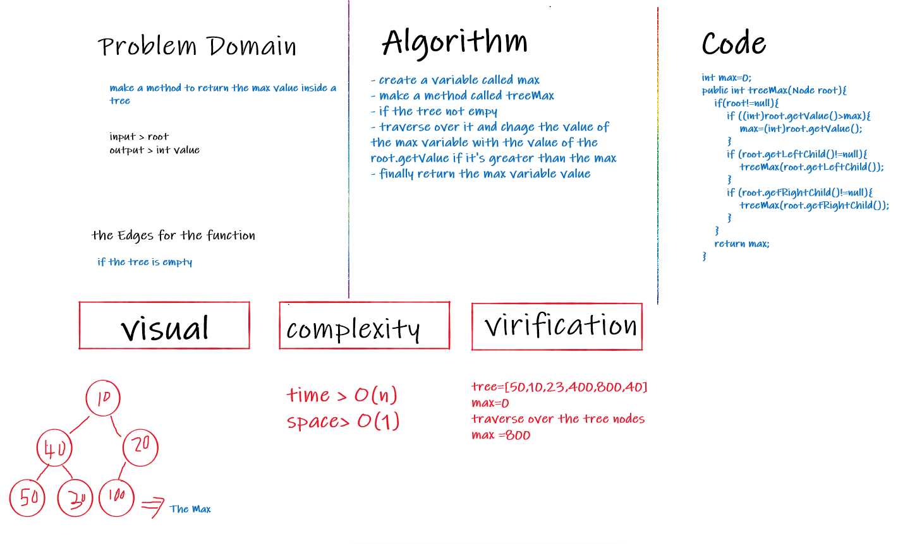
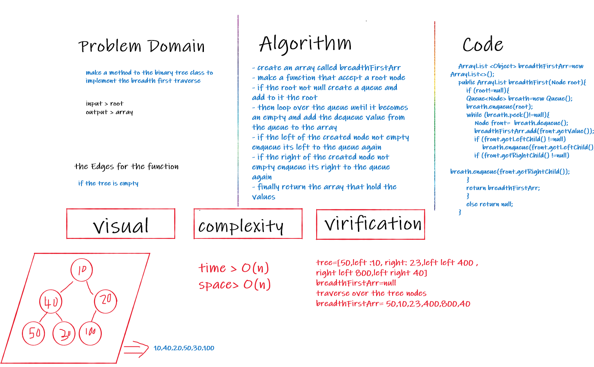

# Trees

<!-- Short summary or background information -->

### An non linear data structure, It is a collection of nodes and edges,General trees consist of the nodes having any number of child nodes. But in case of binary trees every node can have at the most two child nodes and There is a unique node called root in trees.

## Challenge

<!-- Description of the challenge -->
Create the implementation for 
- Node that have the value and the left child node and the right child node 
- Binary Tree which has these methods preOrder,inOrder and the postOrder to traverse in the trees
- Binary Search Tree that is a sub class of the Binary tree with two more methods (Add and contains)

## Approach & Efficiency

<!-- What approach did you take? Why? What is the Big O space/time for this approach? -->
the approach that I've used to implement these methods the recursive functions
- the traversing methods has the complexity : O(n) for the space and O(n) for the time
- the add complexity : O(n) for the time and the space
- the contains complexity : O(n) for the time and the space
## API

<!-- Description of each method publicly available in each of your trees -->
-  depth first traversals:
   - pre order : traverse over the tree (Root,Left,Right)
   - in order: traverse over the tree (Left,Root,Right)
   - post order : traverse over the tree (Left,Right,Root)
- Add to add a node hold the accepted value to the proper position inside the tree
- Contains that checks if the tree has the node with accepted value
----------------------------------------------------

# Challenge Summary
<!-- Description of the challenge -->
Add method to return the max value inside the tree 

## Whiteboard Process
<!-- Embedded whiteboard image -->

## Approach & Efficiency
<!-- What approach did you take? Why? What is the Big O space/time for this approach? -->
the approach that I've used in this challenge the recursion function 
With complexity : time > O(n) , space > O(1)

[comment]: <> (## Solution)

[comment]: <> (<!-- Show how to run your code, and examples of it in action -->)

----------------------------------------------------

# Challenge Summary
<!-- Description of the challenge -->
Add method to the tree to handle the breadth first traverse level by level 

## Whiteboard Process
<!-- Embedded whiteboard image -->

## Approach & Efficiency
<!-- What approach did you take? Why? What is the Big O space/time for this approach? -->
the approach that I've used in this challenge the while loop
With complexity : time > O(n) , space > O(n)

[comment]: <> (## Solution)

[comment]: <> (<!-- Show how to run your code, and examples of it in action -->)